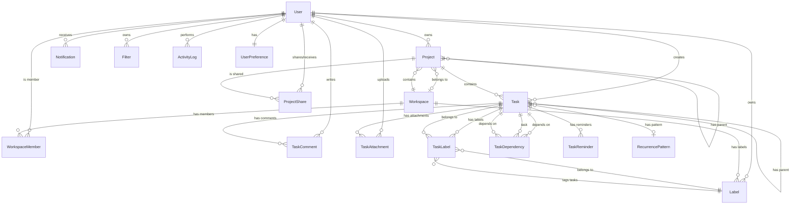

# Todoist Clone - Entities and ERD Documentation

## Table of Contents
1. [Entity Overview](#entity-overview)
2. [Entity Details](#entity-details)
3. [Entity Relationships](#entity-relationships)
4. [ERD Diagram](#erd-diagram)
5. [Database Schema](#database-schema)

---

## Entity Overview

### Core Entities
1. **User** (Extended from ABP Identity)
2. **Project**
3. **Task**
4. **Label**
5. **Workspace**

### Supporting Entities
6. **TaskLabel** (Junction)
7. **TaskDependency**
8. **TaskComment**
9. **TaskAttachment**
10. **TaskReminder**
11. **RecurrencePattern**
12. **Filter**
13. **WorkspaceMember**
14. **ProjectShare**
15. **ActivityLog**
16. **Notification**
17. **UserPreference**
18. **ApplicationSetting**

---

## Entity Details

### 1. User (Extended from ABP Identity.User)
**Base**: ABP Identity User Entity  
**Description**: Represents application users with extended profile information.

**Additional Properties:**
| Property | Type | Required | Description |
|----------|------|----------|-------------|
| DisplayName | string(256) | Yes | User's display name |
| AvatarUrl | string(512) | No | URL to user's avatar image |
| TimeZone | string(50) | No | User's timezone (e.g., "UTC", "America/New_York") |
| Language | string(10) | No | Preferred language code |

**Relationships:**
- One-to-Many: Projects (Owner)
- One-to-Many: Tasks (CreatedBy)
- One-to-Many: Comments
- One-to-Many: WorkspaceMembers
- One-to-Many: Notifications
- One-to-One: UserPreference

---

### 2. Project
**Description**: Represents a project that can contain tasks. Supports hierarchical structure.

**Properties:**
| Property | Type | Required | Description |
|----------|------|----------|-------------|
| Id | Guid | Yes | Primary key |
| Name | string(256) | Yes | Project name |
| Description | string(2000) | No | Project description |
| Color | string(7) | No | Hex color code (e.g., "#FF5733") |
| Icon | string(50) | No | Icon identifier |
| ParentId | Guid? | No | Parent project ID (for hierarchy) |
| OwnerId | Guid | Yes | User who owns the project |
| WorkspaceId | Guid? | No | Workspace ID (if part of workspace) |
| Order | int | Yes | Display order |
| IsArchived | bool | Yes | Whether project is archived |
| IsFavorite | bool | Yes | Whether project is favorited |
| CreatedAt | DateTime | Yes | Creation timestamp |
| CreatedBy | Guid? | No | Creator user ID |
| ModifiedAt | DateTime? | No | Last modification timestamp |
| ModifiedBy | Guid? | No | Last modifier user ID |
| IsDeleted | bool | Yes | Soft delete flag |
| DeletedAt | DateTime? | No | Deletion timestamp |
| TenantId | Guid? | No | Tenant ID (for multi-tenancy) |

**Relationships:**
- Many-to-One: User (Owner)
- Many-to-One: Project (Parent)
- One-to-Many: Project (Children)
- One-to-Many: Tasks
- One-to-Many: ProjectShares
- Many-to-One: Workspace

**Indexes:**
- IX_Projects_OwnerId
- IX_Projects_ParentId
- IX_Projects_WorkspaceId
- IX_Projects_IsDeleted

---

### 3. Task
**Description**: Represents a task that can belong to a project, have subtasks, dependencies, labels, etc.

**Properties:**
| Property | Type | Required | Description |
|----------|------|----------|-------------|
| Id | Guid | Yes | Primary key |
| Title | string(500) | Yes | Task title |
| Description | string(5000) | No | Task description (rich text) |
| ProjectId | Guid? | No | Project ID (null for inbox) |
| ParentTaskId | Guid? | No | Parent task ID (for subtasks) |
| Priority | int | Yes | Priority level (1=P1, 2=P2, 3=P3, 4=P4, 5=P5) |
| Status | int | Yes | Status (0=Incomplete, 1=Complete) |
| DueDate | DateTime? | No | Due date |
| DueTime | TimeSpan? | No | Due time |
| CompletedAt | DateTime? | No | Completion timestamp |
| CompletedBy | Guid? | No | User who completed the task |
| Order | int | Yes | Display order within project/parent |
| EstimatedDuration | int? | No | Estimated duration in minutes |
| ActualDuration | int? | No | Actual duration in minutes |
| CreatedAt | DateTime | Yes | Creation timestamp |
| CreatedBy | Guid | Yes | Creator user ID |
| ModifiedAt | DateTime? | No | Last modification timestamp |
| ModifiedBy | Guid? | No | Last modifier user ID |
| IsDeleted | bool | Yes | Soft delete flag |
| DeletedAt | DateTime? | No | Deletion timestamp |
| TenantId | Guid? | No | Tenant ID (for multi-tenancy) |
| RowVersion | byte[] | Yes | Concurrency token |

**Relationships:**
- Many-to-One: Project
- Many-to-One: Task (ParentTask)
- One-to-Many: Task (Subtasks)
- One-to-Many: TaskLabels
- One-to-Many: TaskDependencies (as Task)
- One-to-Many: TaskDependencies (as DependsOnTask)
- One-to-Many: TaskComments
- One-to-Many: TaskAttachments
- One-to-Many: TaskReminders
- Many-to-One: RecurrencePattern
- Many-to-One: User (CreatedBy)

**Indexes:**
- IX_Tasks_ProjectId
- IX_Tasks_ParentTaskId
- IX_Tasks_CreatedBy
- IX_Tasks_DueDate
- IX_Tasks_Priority
- IX_Tasks_Status
- IX_Tasks_IsDeleted

---

### 4. Label
**Description**: Represents a label/tag that can be assigned to tasks.

**Properties:**
| Property | Type | Required | Description |
|----------|------|----------|-------------|
| Id | Guid | Yes | Primary key |
| Name | string(100) | Yes | Label name (unique per user/workspace) |
| Color | string(7) | Yes | Hex color code |
| Icon | string(50) | No | Icon identifier |
| OwnerId | Guid | Yes | User who owns the label |
| WorkspaceId | Guid? | No | Workspace ID (if workspace label) |
| CreatedAt | DateTime | Yes | Creation timestamp |
| CreatedBy | Guid | Yes | Creator user ID |
| ModifiedAt | DateTime? | No | Last modification timestamp |
| ModifiedBy | Guid? | No | Last modifier user ID |
| IsDeleted | bool | Yes | Soft delete flag |
| DeletedAt | DateTime? | No | Deletion timestamp |
| TenantId | Guid? | No | Tenant ID (for multi-tenancy) |

**Relationships:**
- Many-to-One: User (Owner)
- Many-to-One: Workspace
- One-to-Many: TaskLabels

**Indexes:**
- IX_Labels_OwnerId
- IX_Labels_WorkspaceId
- IX_Labels_IsDeleted
- UQ_Labels_OwnerId_Name (Unique constraint)

---

### 5. Workspace
**Description**: Represents a team workspace for collaboration.

**Properties:**
| Property | Type | Required | Description |
|----------|------|----------|-------------|
| Id | Guid | Yes | Primary key |
| Name | string(256) | Yes | Workspace name |
| Description | string(1000) | No | Workspace description |
| OwnerId | Guid | Yes | Workspace owner user ID |
| CreatedAt | DateTime | Yes | Creation timestamp |
| CreatedBy | Guid | Yes | Creator user ID |
| ModifiedAt | DateTime? | No | Last modification timestamp |
| ModifiedBy | Guid? | No | Last modifier user ID |
| IsDeleted | bool | Yes | Soft delete flag |
| DeletedAt | DateTime? | No | Deletion timestamp |
| TenantId | Guid? | No | Tenant ID (for multi-tenancy) |

**Relationships:**
- Many-to-One: User (Owner)
- One-to-Many: WorkspaceMembers
- One-to-Many: Projects
- One-to-Many: Labels

**Indexes:**
- IX_Workspaces_OwnerId
- IX_Workspaces_IsDeleted

---

### 6. TaskLabel (Junction Entity)
**Description**: Many-to-many relationship between Tasks and Labels.

**Properties:**
| Property | Type | Required | Description |
|----------|------|----------|-------------|
| TaskId | Guid | Yes | Task ID (composite key) |
| LabelId | Guid | Yes | Label ID (composite key) |
| CreatedAt | DateTime | Yes | Creation timestamp |

**Relationships:**
- Many-to-One: Task
- Many-to-One: Label

**Indexes:**
- PK_TaskLabels (Composite: TaskId, LabelId)
- IX_TaskLabels_TaskId
- IX_TaskLabels_LabelId

---

### 7. TaskDependency
**Description**: Represents a dependency relationship between tasks.

**Properties:**
| Property | Type | Required | Description |
|----------|------|----------|-------------|
| Id | Guid | Yes | Primary key |
| TaskId | Guid | Yes | Task ID |
| DependsOnTaskId | Guid | Yes | Task that this task depends on |
| DependencyType | int | Yes | Type (0=FinishToStart, 1=StartToStart, 2=FinishToFinish, 3=StartToFinish) |
| CreatedAt | DateTime | Yes | Creation timestamp |

**Relationships:**
- Many-to-One: Task (Task)
- Many-to-One: Task (DependsOnTask)

**Indexes:**
- IX_TaskDependencies_TaskId
- IX_TaskDependencies_DependsOnTaskId
- UQ_TaskDependencies_TaskId_DependsOnTaskId (Unique constraint to prevent duplicates)

---

### 8. TaskComment
**Description**: Represents a comment on a task.

**Properties:**
| Property | Type | Required | Description |
|----------|------|----------|-------------|
| Id | Guid | Yes | Primary key |
| TaskId | Guid | Yes | Task ID |
| Content | string(5000) | Yes | Comment content (rich text) |
| AuthorId | Guid | Yes | User who wrote the comment |
| ParentCommentId | Guid? | No | Parent comment ID (for threaded comments) |
| Mentions | string(1000) | No | JSON array of mentioned user IDs |
| CreatedAt | DateTime | Yes | Creation timestamp |
| CreatedBy | Guid | Yes | Creator user ID |
| ModifiedAt | DateTime? | No | Last modification timestamp |
| ModifiedBy | Guid? | No | Last modifier user ID |
| IsDeleted | bool | Yes | Soft delete flag |
| DeletedAt | DateTime? | No | Deletion timestamp |
| TenantId | Guid? | No | Tenant ID (for multi-tenancy) |

**Relationships:**
- Many-to-One: Task
- Many-to-One: User (Author)
- Many-to-One: TaskComment (ParentComment)
- One-to-Many: TaskComment (Replies)

**Indexes:**
- IX_TaskComments_TaskId
- IX_TaskComments_AuthorId
- IX_TaskComments_ParentCommentId
- IX_TaskComments_IsDeleted

---

### 9. TaskAttachment
**Description**: Represents a file attachment on a task.

**Properties:**
| Property | Type | Required | Description |
|----------|------|----------|-------------|
| Id | Guid | Yes | Primary key |
| TaskId | Guid | Yes | Task ID |
| FileName | string(500) | Yes | Original file name |
| FileSize | long | Yes | File size in bytes |
| MimeType | string(100) | Yes | MIME type |
| BlobName | string(500) | Yes | Blob storage identifier |
| UploadedById | Guid | Yes | User who uploaded the file |
| CreatedAt | DateTime | Yes | Creation timestamp |
| CreatedBy | Guid | Yes | Creator user ID |
| IsDeleted | bool | Yes | Soft delete flag |
| DeletedAt | DateTime? | No | Deletion timestamp |
| TenantId | Guid? | No | Tenant ID (for multi-tenancy) |

**Relationships:**
- Many-to-One: Task
- Many-to-One: User (UploadedBy)

**Indexes:**
- IX_TaskAttachments_TaskId
- IX_TaskAttachments_UploadedById
- IX_TaskAttachments_IsDeleted

**Constraints:**
- FileSize <= 500MB (524288000 bytes)

---

### 10. TaskReminder
**Description**: Represents a reminder for a task.

**Properties:**
| Property | Type | Required | Description |
|----------|------|----------|-------------|
| Id | Guid | Yes | Primary key |
| TaskId | Guid | Yes | Task ID |
| ReminderDate | DateTime | Yes | When to remind |
| ReminderType | int | Yes | Type (0=OnDueDate, 1=BeforeDueDate, 2=Custom) |
| BeforeMinutes | int? | No | Minutes before due date (if BeforeDueDate) |
| IsTriggered | bool | Yes | Whether reminder has been triggered |
| TriggeredAt | DateTime? | No | When reminder was triggered |
| CreatedAt | DateTime | Yes | Creation timestamp |
| CreatedBy | Guid | Yes | Creator user ID |
| TenantId | Guid? | No | Tenant ID (for multi-tenancy) |

**Relationships:**
- Many-to-One: Task

**Indexes:**
- IX_TaskReminders_TaskId
- IX_TaskReminders_ReminderDate
- IX_TaskReminders_IsTriggered

---

### 11. RecurrencePattern
**Description**: Represents a recurrence pattern for recurring tasks.

**Properties:**
| Property | Type | Required | Description |
|----------|------|----------|-------------|
| Id | Guid | Yes | Primary key |
| RecurrenceType | int | Yes | Type (0=Daily, 1=Weekly, 2=Monthly, 3=Yearly, 4=Custom) |
| Interval | int | Yes | Interval (e.g., every 2 weeks = 2) |
| DaysOfWeek | string(50) | No | Days of week (comma-separated: 0=Sunday, 6=Saturday) |
| DayOfMonth | int? | No | Day of month (1-31) |
| MonthOfYear | int? | No | Month of year (1-12) |
| EndDate | DateTime? | No | End date for recurrence |
| OccurrenceCount | int? | No | Number of occurrences |
| CustomRule | string(500) | No | Custom recurrence rule (iCal format) |
| CreatedAt | DateTime | Yes | Creation timestamp |
| CreatedBy | Guid | Yes | Creator user ID |
| TenantId | Guid? | No | Tenant ID (for multi-tenancy) |

**Relationships:**
- One-to-Many: Tasks

**Indexes:**
- IX_RecurrencePatterns_RecurrenceType

---

### 12. Filter
**Description**: Represents a saved filter/view.

**Properties:**
| Property | Type | Required | Description |
|----------|------|----------|-------------|
| Id | Guid | Yes | Primary key |
| Name | string(256) | Yes | Filter name |
| Query | string(2000) | Yes | Filter query (JSON) |
| OwnerId | Guid | Yes | User who owns the filter |
| IsDefault | bool | Yes | Whether this is a default filter |
| Order | int | Yes | Display order |
| CreatedAt | DateTime | Yes | Creation timestamp |
| CreatedBy | Guid | Yes | Creator user ID |
| ModifiedAt | DateTime? | No | Last modification timestamp |
| ModifiedBy | Guid? | No | Last modifier user ID |
| IsDeleted | bool | Yes | Soft delete flag |
| DeletedAt | DateTime? | No | Deletion timestamp |
| TenantId | Guid? | No | Tenant ID (for multi-tenancy) |

**Relationships:**
- Many-to-One: User (Owner)

**Indexes:**
- IX_Filters_OwnerId
- IX_Filters_IsDeleted

---

### 13. WorkspaceMember
**Description**: Represents a member of a workspace.

**Properties:**
| Property | Type | Required | Description |
|----------|------|----------|-------------|
| Id | Guid | Yes | Primary key |
| WorkspaceId | Guid | Yes | Workspace ID |
| UserId | Guid | Yes | User ID |
| Role | int | Yes | Role (0=Member, 1=Admin, 2=Owner) |
| JoinedAt | DateTime | Yes | When user joined workspace |
| CreatedAt | DateTime | Yes | Creation timestamp |
| TenantId | Guid? | No | Tenant ID (for multi-tenancy) |

**Relationships:**
- Many-to-One: Workspace
- Many-to-One: User

**Indexes:**
- IX_WorkspaceMembers_WorkspaceId
- IX_WorkspaceMembers_UserId
- UQ_WorkspaceMembers_WorkspaceId_UserId (Unique constraint)

---

### 14. ProjectShare
**Description**: Represents a shared project with specific permissions.

**Properties:**
| Property | Type | Required | Description |
|----------|------|----------|-------------|
| Id | Guid | Yes | Primary key |
| ProjectId | Guid | Yes | Project ID |
| SharedWithUserId | Guid | Yes | User ID of person project is shared with |
| Permission | int | Yes | Permission (0=Read, 1=Write, 2=Admin) |
| SharedAt | DateTime | Yes | When project was shared |
| SharedById | Guid | Yes | User who shared the project |
| CreatedAt | DateTime | Yes | Creation timestamp |
| TenantId | Guid? | No | Tenant ID (for multi-tenancy) |

**Relationships:**
- Many-to-One: Project
- Many-to-One: User (SharedWithUser)
- Many-to-One: User (SharedBy)

**Indexes:**
- IX_ProjectShares_ProjectId
- IX_ProjectShares_SharedWithUserId
- UQ_ProjectShares_ProjectId_SharedWithUserId (Unique constraint)

---

### 15. ActivityLog
**Description**: Represents an activity/event log entry.

**Properties:**
| Property | Type | Required | Description |
|----------|------|----------|-------------|
| Id | Guid | Yes | Primary key |
| EntityType | string(100) | Yes | Entity type (e.g., "Task", "Project") |
| EntityId | Guid | Yes | Entity ID |
| Action | string(50) | Yes | Action (Created, Updated, Deleted, Completed, etc.) |
| ActorId | Guid | Yes | User who performed the action |
| Changes | string(5000) | No | JSON of changes (before/after) |
| Description | string(1000) | No | Human-readable description |
| CreatedAt | DateTime | Yes | Creation timestamp |
| TenantId | Guid? | No | Tenant ID (for multi-tenancy) |

**Relationships:**
- Many-to-One: User (Actor)

**Indexes:**
- IX_ActivityLogs_EntityType_EntityId
- IX_ActivityLogs_ActorId
- IX_ActivityLogs_CreatedAt

---

### 16. Notification
**Description**: Represents an in-app notification.

**Properties:**
| Property | Type | Required | Description |
|----------|------|----------|-------------|
| Id | Guid | Yes | Primary key |
| UserId | Guid | Yes | User ID (recipient) |
| Type | int | Yes | Notification type (0=Task, 1=Comment, 2=Mention, 3=Share, 4=Reminder) |
| Title | string(256) | Yes | Notification title |
| Message | string(1000) | Yes | Notification message |
| EntityType | string(100) | No | Related entity type |
| EntityId | Guid? | No | Related entity ID |
| IsRead | bool | Yes | Whether notification is read |
| ReadAt | DateTime? | No | When notification was read |
| CreatedAt | DateTime | Yes | Creation timestamp |
| TenantId | Guid? | No | Tenant ID (for multi-tenancy) |

**Relationships:**
- Many-to-One: User

**Indexes:**
- IX_Notifications_UserId
- IX_Notifications_IsRead
- IX_Notifications_CreatedAt

---

### 17. UserPreference
**Description**: Represents user preferences and settings.

**Properties:**
| Property | Type | Required | Description |
|----------|------|----------|-------------|
| Id | Guid | Yes | Primary key |
| UserId | Guid | Yes | User ID (unique) |
| Theme | int | Yes | Theme (0=Light, 1=Dark, 2=System) |
| Language | string(10) | No | Language code |
| TimeZone | string(50) | No | Timezone |
| DateFormat | string(20) | No | Date format preference |
| TimeFormat | int | Yes | Time format (0=12h, 1=24h) |
| ArchiveRetentionDays | int | Yes | Days before auto-archiving (default: 30) |
| KeyboardShortcuts | string(5000) | No | JSON of custom keyboard shortcuts |
| CreatedAt | DateTime | Yes | Creation timestamp |
| ModifiedAt | DateTime? | No | Last modification timestamp |
| TenantId | Guid? | No | Tenant ID (for multi-tenancy) |

**Relationships:**
- One-to-One: User

**Indexes:**
- UQ_UserPreferences_UserId (Unique constraint)

---

### 18. ApplicationSetting
**Description**: Represents application-wide settings.

**Properties:**
| Property | Type | Required | Description |
|----------|------|----------|-------------|
| Id | Guid | Yes | Primary key |
| Key | string(100) | Yes | Setting key (unique) |
| Value | string(2000) | Yes | Setting value (JSON) |
| Description | string(500) | No | Setting description |
| CreatedAt | DateTime | Yes | Creation timestamp |
| ModifiedAt | DateTime? | No | Last modification timestamp |
| TenantId | Guid? | No | Tenant ID (for multi-tenancy) |

**Indexes:**
- UQ_ApplicationSettings_Key_TenantId (Unique constraint)

---

## Entity Relationships

### Relationship Summary

```
User
├── 1:N → Projects (Owner)
├── 1:N → Tasks (CreatedBy)
├── 1:N → Labels (Owner)
├── 1:N → WorkspaceMembers
├── 1:N → ProjectShares (SharedWithUser, SharedBy)
├── 1:N → TaskComments (Author)
├── 1:N → TaskAttachments (UploadedBy)
├── 1:N → Notifications
├── 1:N → Filters (Owner)
├── 1:N → ActivityLogs (Actor)
└── 1:1 → UserPreference

Project
├── N:1 → User (Owner)
├── N:1 → Project (Parent)
├── 1:N → Project (Children)
├── 1:N → Tasks
├── 1:N → ProjectShares
└── N:1 → Workspace

Task
├── N:1 → Project
├── N:1 → Task (ParentTask)
├── 1:N → Task (Subtasks)
├── 1:N → TaskLabels
├── 1:N → TaskDependencies (as Task)
├── 1:N → TaskDependencies (as DependsOnTask)
├── 1:N → TaskComments
├── 1:N → TaskAttachments
├── 1:N → TaskReminders
├── N:1 → RecurrencePattern
└── N:1 → User (CreatedBy)

Label
├── N:1 → User (Owner)
├── N:1 → Workspace
└── 1:N → TaskLabels

Workspace
├── N:1 → User (Owner)
├── 1:N → WorkspaceMembers
├── 1:N → Projects
└── 1:N → Labels

TaskLabel (Junction)
├── N:1 → Task
└── N:1 → Label

TaskDependency
├── N:1 → Task (Task)
└── N:1 → Task (DependsOnTask)

TaskComment
├── N:1 → Task
├── N:1 → User (Author)
├── N:1 → TaskComment (ParentComment)
└── 1:N → TaskComment (Replies)

TaskAttachment
├── N:1 → Task
└── N:1 → User (UploadedBy)

TaskReminder
└── N:1 → Task

RecurrencePattern
└── 1:N → Tasks

Filter
└── N:1 → User (Owner)

WorkspaceMember
├── N:1 → Workspace
└── N:1 → User

ProjectShare
├── N:1 → Project
├── N:1 → User (SharedWithUser)
└── N:1 → User (SharedBy)
```

---

## ERD Diagram

### Visual ERD (Mermaid Format)



### Key Relationships Explained

1. **User ↔ Project**: One user can own many projects
2. **Project ↔ Project**: Self-referencing for hierarchy (parent-child)
3. **Project ↔ Task**: One project contains many tasks
4. **Task ↔ Task**: Self-referencing for subtasks (parent-child)
5. **Task ↔ Label**: Many-to-many via TaskLabel junction
6. **Task ↔ TaskDependency**: Task can depend on multiple other tasks
7. **Task ↔ TaskComment**: One task has many comments
8. **Task ↔ TaskAttachment**: One task has many attachments
9. **Task ↔ TaskReminder**: One task can have multiple reminders
10. **Workspace ↔ WorkspaceMember**: Many-to-many via WorkspaceMember
11. **Project ↔ ProjectShare**: One project can be shared with many users

---

## Database Schema

### Common Fields (Base Entity Pattern)
All entities inherit from ABP base entity classes which provide:
- `Id` (Guid, Primary Key)
- `CreationTime` (DateTime)
- `CreatorId` (Guid?)
- `LastModificationTime` (DateTime?)
- `LastModifierId` (Guid?)
- `IsDeleted` (bool)
- `DeletionTime` (DateTime?)
- `TenantId` (Guid?) - For multi-tenancy

### Concurrency Control
- Tasks use `RowVersion` (byte[]) for optimistic concurrency
- Other entities use timestamp-based concurrency where needed

### Soft Delete
- All entities support soft delete via `IsDeleted` flag
- Deleted entities are filtered out by default in queries
- Hard delete available for admin operations

### Multi-tenancy
- All entities support `TenantId` for multi-tenant scenarios
- Single-tenant mode: `TenantId` is null
- Multi-tenant mode: `TenantId` is set and used for data isolation

### Audit Fields
- `CreatedAt` / `CreatedBy`: Track creation
- `ModifiedAt` / `ModifiedBy`: Track modifications
- `DeletedAt`: Track deletion time
- `ActivityLog`: Separate table for detailed activity tracking

---

## Data Validation Rules

### Project
- Name: Required, 1-256 characters
- ParentId: Cannot be self or create circular reference
- Color: Valid hex color code format (#RRGGBB)

### Task
- Title: Required, 1-500 characters
- Priority: Must be 1-5 (P1-P5)
- Status: 0 (Incomplete) or 1 (Complete)
- DueDate: Must be in the future (or null)
- ParentTaskId: Cannot be self or create circular reference
- Order: Must be >= 0

### Label
- Name: Required, 1-100 characters, unique per owner/workspace
- Color: Required, valid hex color code

### TaskDependency
- TaskId and DependsOnTaskId must be different
- Cannot create circular dependencies
- Must validate dependency chain

### TaskAttachment
- FileSize: Maximum 500MB (524288000 bytes)
- FileName: Required, 1-500 characters
- MimeType: Required, must be in allowed list

### RecurrencePattern
- Interval: Must be > 0
- EndDate or OccurrenceCount: At least one must be set (or neither for infinite)
- CustomRule: Must be valid iCal format if RecurrenceType is Custom

---

## Indexing Strategy

### Primary Indexes
- All entities: `PK_{TableName}` on `Id`

### Foreign Key Indexes
- All foreign keys have corresponding indexes for join performance

### Query Optimization Indexes
- **Tasks**: `IX_Tasks_ProjectId`, `IX_Tasks_DueDate`, `IX_Tasks_Priority`, `IX_Tasks_Status`
- **Projects**: `IX_Projects_OwnerId`, `IX_Projects_ParentId`
- **TaskLabels**: `IX_TaskLabels_TaskId`, `IX_TaskLabels_LabelId`
- **Notifications**: `IX_Notifications_UserId_IsRead`
- **ActivityLogs**: `IX_ActivityLogs_EntityType_EntityId_CreatedAt`

### Unique Constraints
- `UQ_Labels_OwnerId_Name`: Label name unique per owner
- `UQ_WorkspaceMembers_WorkspaceId_UserId`: User can only be member once per workspace
- `UQ_ProjectShares_ProjectId_SharedWithUserId`: Project can only be shared once per user
- `UQ_UserPreferences_UserId`: One preference record per user
- `UQ_ApplicationSettings_Key_TenantId`: Setting key unique per tenant

---

*This ERD documentation will be updated as the database schema evolves during development.*

