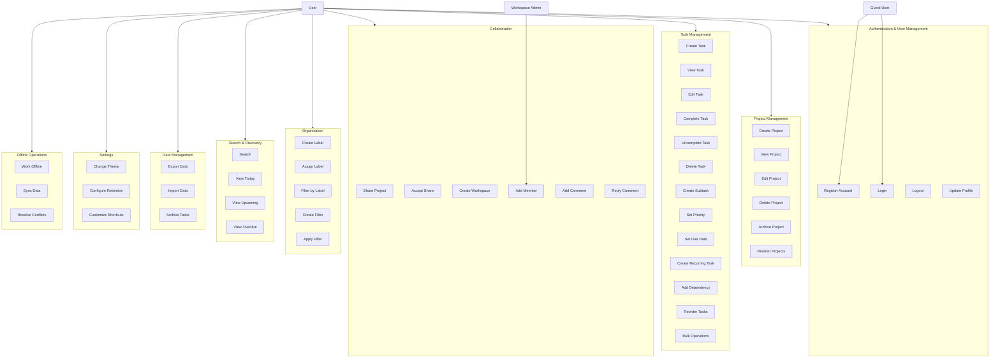
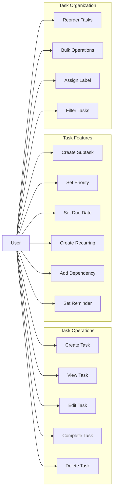

# Todoist Clone - Use Cases and Use Case Diagrams

## Table of Contents
1. [Use Case Overview](#use-case-overview)
2. [Actor Definitions](#actor-definitions)
3. [Use Case Details](#use-case-details)
4. [Use Case Diagrams](#use-case-diagrams)
5. [Use Case Scenarios](#use-case-scenarios)

---

## Use Case Overview

### Functional Areas
1. **Authentication & User Management**
2. **Project Management**
3. **Task Management**
4. **Collaboration**
5. **Organization & Filtering**
6. **Search & Discovery**
7. **Data Management**
8. **Settings & Preferences**
9. **Notifications**
10. **Offline Operations**

### Total Use Cases: 60+

---

## Actor Definitions

### Primary Actors
1. **User**: Regular application user
2. **Guest User**: Unauthenticated user (limited access)
3. **Workspace Admin**: User with admin rights in a workspace
4. **Workspace Owner**: User who owns a workspace
5. **Project Owner**: User who owns a project
6. **System**: Automated system processes

### Secondary Actors
1. **Email Service**: For email notifications (future)
2. **File Storage**: For attachment storage
3. **Notification Service**: For in-app notifications

---

## Use Case Details

### 1. Authentication & User Management

#### UC-001: Register Account
**Actor**: Guest User  
**Description**: User creates a new account with email and password  
**Preconditions**: User is not logged in  
**Main Flow**:
1. User navigates to registration page
2. User enters email, password, and display name
3. System validates input
4. System creates user account
5. System sends verification email (optional)
6. User is logged in automatically
7. System displays welcome screen

**Alternative Flows**:
- 3a. Validation fails: System displays error messages
- 4a. Email already exists: System displays error message

**Postconditions**: User account created and user is logged in

---

#### UC-002: Login
**Actor**: Guest User  
**Description**: User logs in with email and password or OAuth  
**Preconditions**: User has an account  
**Main Flow**:
1. User navigates to login page
2. User enters email and password (or selects OAuth provider)
3. System validates credentials
4. System generates access token and refresh token
5. System stores tokens securely
6. User is redirected to dashboard

**Alternative Flows**:
- 3a. Invalid credentials: System displays error message
- 3b. OAuth login: System redirects to OAuth provider, then back with token

**Postconditions**: User is authenticated and logged in

---

#### UC-003: Logout
**Actor**: User  
**Description**: User logs out of the application  
**Preconditions**: User is logged in  
**Main Flow**:
1. User clicks logout button
2. System invalidates tokens
3. System clears local storage
4. User is redirected to login page

**Postconditions**: User is logged out

---

#### UC-004: Update Profile
**Actor**: User  
**Description**: User updates their profile information  
**Preconditions**: User is logged in  
**Main Flow**:
1. User navigates to profile page
2. User updates display name, avatar, timezone, or language
3. System validates input
4. System saves changes
5. System displays success message

**Postconditions**: User profile is updated

---

### 2. Project Management

#### UC-005: Create Project
**Actor**: User  
**Description**: User creates a new project  
**Preconditions**: User is logged in  
**Main Flow**:
1. User clicks "New Project" button
2. User enters project name, description, color, and icon
3. User optionally selects parent project (for hierarchy)
4. User optionally selects workspace
5. System validates input
6. System creates project
7. System displays project in project list

**Alternative Flows**:
- 3a. User selects parent: System validates parent is not a descendant
- 5a. Validation fails: System displays error messages

**Postconditions**: New project is created and visible

---

#### UC-006: View Project
**Actor**: User  
**Description**: User views project details and tasks  
**Preconditions**: User is logged in, has access to project  
**Main Flow**:
1. User selects project from project list
2. System loads project details
3. System loads tasks in project
4. System displays project view with tasks

**Postconditions**: Project details and tasks are displayed

---

#### UC-007: Edit Project
**Actor**: User (Project Owner or Admin)  
**Description**: User updates project information  
**Preconditions**: User has edit permission for project  
**Main Flow**:
1. User opens project settings
2. User modifies name, description, color, or icon
3. System validates input
4. System saves changes
5. System displays updated project

**Postconditions**: Project is updated

---

#### UC-008: Delete Project
**Actor**: User (Project Owner or Admin)  
**Description**: User deletes a project  
**Preconditions**: User has delete permission for project  
**Main Flow**:
1. User selects delete option
2. System confirms deletion
3. User confirms deletion
4. System soft-deletes project and all tasks
5. System displays confirmation message

**Alternative Flows**:
- 2a. Project has tasks: System warns user about task deletion
- 3a. User cancels: Operation is cancelled

**Postconditions**: Project is deleted (soft delete)

---

#### UC-009: Archive Project
**Actor**: User (Project Owner or Admin)  
**Description**: User archives a project  
**Preconditions**: User has edit permission for project  
**Main Flow**:
1. User selects archive option
2. System archives project
3. Project is moved to archived section
4. System displays confirmation

**Postconditions**: Project is archived

---

#### UC-010: Reorder Projects
**Actor**: User  
**Description**: User reorders projects using drag-and-drop  
**Preconditions**: User is logged in  
**Main Flow**:
1. User drags project to new position
2. System updates project order
3. System saves new order
4. Project list is refreshed with new order

**Postconditions**: Projects are reordered

---

### 3. Task Management

#### UC-011: Create Task
**Actor**: User  
**Description**: User creates a new task  
**Preconditions**: User is logged in  
**Main Flow**:
1. User clicks "New Task" button
2. User enters task title and description
3. User optionally selects project, priority, due date, labels
4. System validates input
5. System creates task
6. System displays task in task list

**Alternative Flows**:
- 3a. User creates subtask: User selects parent task
- 5a. Validation fails: System displays error messages

**Postconditions**: New task is created

---

#### UC-012: View Task
**Actor**: User  
**Description**: User views task details  
**Preconditions**: User is logged in, has access to task  
**Main Flow**:
1. User clicks on task
2. System loads task details
3. System loads subtasks, comments, attachments, dependencies
4. System displays task detail view

**Postconditions**: Task details are displayed

---

#### UC-013: Edit Task
**Actor**: User (Task Creator or Project Admin)  
**Description**: User updates task information  
**Preconditions**: User has edit permission for task  
**Main Flow**:
1. User opens task edit form
2. User modifies task properties
3. System validates input
4. System saves changes
5. System displays updated task

**Postconditions**: Task is updated

---

#### UC-014: Complete Task
**Actor**: User  
**Description**: User marks a task as complete  
**Preconditions**: User has access to task, task is not complete  
**Main Flow**:
1. User clicks complete checkbox
2. System marks task as complete
3. System records completion timestamp
4. System updates task status
5. Task is moved to completed section

**Alternative Flows**:
- 2a. Task has incomplete subtasks: System warns user
- 2b. Task has incomplete dependencies: System warns user

**Postconditions**: Task is marked as complete

---

#### UC-015: Uncomplete Task
**Actor**: User  
**Description**: User marks a completed task as incomplete  
**Preconditions**: User has access to task, task is complete  
**Main Flow**:
1. User clicks uncomplete option
2. System marks task as incomplete
3. System clears completion timestamp
4. Task is moved back to active tasks

**Postconditions**: Task is marked as incomplete

---

#### UC-016: Delete Task
**Actor**: User (Task Creator or Project Admin)  
**Description**: User deletes a task  
**Preconditions**: User has delete permission for task  
**Main Flow**:
1. User selects delete option
2. System confirms deletion
3. User confirms deletion
4. System soft-deletes task
5. System displays confirmation message

**Postconditions**: Task is deleted (soft delete)

---

#### UC-017: Create Subtask
**Actor**: User  
**Description**: User creates a subtask under a parent task  
**Preconditions**: User has access to parent task  
**Main Flow**:
1. User opens parent task
2. User clicks "Add Subtask"
3. User enters subtask title
4. System validates input
5. System creates subtask linked to parent
6. System displays subtask in parent task view

**Postconditions**: Subtask is created and linked to parent

---

#### UC-018: Set Task Priority
**Actor**: User  
**Description**: User sets task priority (P1-P5)  
**Preconditions**: User has edit permission for task  
**Main Flow**:
1. User opens task
2. User selects priority level (P1-P5)
3. System updates task priority
4. Task is visually updated with priority indicator

**Postconditions**: Task priority is updated

---

#### UC-019: Set Due Date
**Actor**: User  
**Description**: User sets due date and time for a task  
**Preconditions**: User has edit permission for task  
**Main Flow**:
1. User opens task
2. User selects due date and optional time
3. System validates date is not in past
4. System updates task due date
5. Task appears in "Upcoming" view if applicable

**Postconditions**: Task due date is set

---

#### UC-020: Create Recurring Task
**Actor**: User  
**Description**: User creates a task that repeats  
**Preconditions**: User has edit permission  
**Main Flow**:
1. User creates or edits task
2. User enables recurrence
3. User selects recurrence pattern (daily, weekly, monthly, yearly, custom)
4. User sets interval and end conditions
5. System creates recurrence pattern
6. System generates recurring task instances

**Alternative Flows**:
- 4a. Custom pattern: User enters iCal format rule

**Postconditions**: Recurring task pattern is created

---

#### UC-021: Add Task Dependency
**Actor**: User  
**Description**: User adds a dependency between tasks  
**Preconditions**: User has edit permission for task  
**Main Flow**:
1. User opens task
2. User selects "Add Dependency"
3. User selects task that this task depends on
4. System validates no circular dependency
5. System creates dependency relationship
6. System updates task status if dependency is incomplete

**Alternative Flows**:
- 4a. Circular dependency detected: System displays error message

**Postconditions**: Task dependency is created

---

#### UC-022: Reorder Tasks
**Actor**: User  
**Description**: User reorders tasks using drag-and-drop  
**Preconditions**: User is logged in  
**Main Flow**:
1. User drags task to new position
2. System updates task order
3. System saves new order
4. Task list is refreshed with new order

**Postconditions**: Tasks are reordered

---

#### UC-023: Bulk Operations on Tasks
**Actor**: User  
**Description**: User performs bulk operations on multiple tasks  
**Preconditions**: User is logged in  
**Main Flow**:
1. User selects multiple tasks
2. User selects bulk action (complete, delete, move, change priority, add labels)
3. User confirms action
4. System performs action on all selected tasks
5. System displays confirmation message

**Postconditions**: Bulk operation is completed

---

### 4. Labels & Organization

#### UC-024: Create Label
**Actor**: User  
**Description**: User creates a new label  
**Preconditions**: User is logged in  
**Main Flow**:
1. User navigates to labels section
2. User clicks "New Label"
3. User enters label name, color, and optional icon
4. User optionally selects workspace
5. System validates input (unique name)
6. System creates label
7. Label appears in label list

**Postconditions**: New label is created

---

#### UC-025: Assign Label to Task
**Actor**: User  
**Description**: User assigns a label to a task  
**Preconditions**: User has edit permission for task  
**Main Flow**:
1. User opens task
2. User selects "Add Label"
3. User selects label(s) from list
4. System assigns label(s) to task
5. Task displays label indicators

**Postconditions**: Label is assigned to task

---

#### UC-026: Filter Tasks by Label
**Actor**: User  
**Description**: User filters tasks by label  
**Preconditions**: User is logged in  
**Main Flow**:
1. User selects label from label list
2. System filters tasks to show only tasks with selected label
3. System displays filtered task list

**Postconditions**: Task list is filtered by label

---

#### UC-027: Create Filter
**Actor**: User  
**Description**: User creates a saved filter/view  
**Preconditions**: User is logged in  
**Main Flow**:
1. User applies filters to task list
2. User clicks "Save Filter"
3. User enters filter name
4. System saves filter with current filter criteria
5. Filter appears in saved filters list

**Postconditions**: Filter is saved

---

#### UC-028: Apply Saved Filter
**Actor**: User  
**Description**: User applies a saved filter  
**Preconditions**: User has saved filters  
**Main Flow**:
1. User selects saved filter from list
2. System applies filter criteria
3. System displays filtered task list

**Postconditions**: Filter is applied and task list is filtered

---

### 5. Collaboration

#### UC-029: Share Project
**Actor**: User (Project Owner or Admin)  
**Description**: User shares a project with another user  
**Preconditions**: User has share permission for project  
**Main Flow**:
1. User opens project settings
2. User clicks "Share Project"
3. User enters email or selects user
4. User selects permission level (Read, Write, Admin)
5. System sends share invitation
6. System creates ProjectShare record
7. Shared user receives notification

**Postconditions**: Project is shared with user

---

#### UC-030: Accept Project Share
**Actor**: User  
**Description**: User accepts a project share invitation  
**Preconditions**: User has received share invitation  
**Main Flow**:
1. User receives notification about shared project
2. User opens notification
3. User clicks "Accept"
4. System grants access to project
5. Project appears in user's project list

**Postconditions**: User has access to shared project

---

#### UC-031: Create Workspace
**Actor**: User  
**Description**: User creates a team workspace  
**Preconditions**: User is logged in  
**Main Flow**:
1. User navigates to workspaces section
2. User clicks "New Workspace"
3. User enters workspace name and description
4. System creates workspace
5. User is set as workspace owner
6. Workspace appears in workspace list

**Postconditions**: Workspace is created

---

#### UC-032: Add Workspace Member
**Actor**: User (Workspace Admin or Owner)  
**Description**: User adds a member to workspace  
**Preconditions**: User has admin rights in workspace  
**Main Flow**:
1. User opens workspace settings
2. User clicks "Add Member"
3. User enters email or selects user
4. User selects role (Member, Admin)
5. System sends invitation
6. System creates WorkspaceMember record
7. User receives notification

**Postconditions**: User is added to workspace

---

#### UC-033: Add Comment to Task
**Actor**: User  
**Description**: User adds a comment to a task  
**Preconditions**: User has access to task  
**Main Flow**:
1. User opens task
2. User navigates to comments section
3. User enters comment text
4. User optionally mentions other users (@username)
5. System creates comment
6. System sends notifications to mentioned users
7. Comment appears in task comments

**Postconditions**: Comment is added to task

---

#### UC-034: Reply to Comment
**Actor**: User  
**Description**: User replies to a comment  
**Preconditions**: User has access to task  
**Main Flow**:
1. User views comment
2. User clicks "Reply"
3. User enters reply text
4. System creates reply linked to parent comment
5. Reply appears as threaded comment

**Postconditions**: Reply is added to comment thread

---

### 6. Attachments & Files

#### UC-035: Upload Attachment
**Actor**: User  
**Description**: User uploads a file attachment to a task  
**Preconditions**: User has edit permission for task  
**Main Flow**:
1. User opens task
2. User clicks "Add Attachment"
3. User selects file (max 500MB)
4. System validates file size and type
5. System uploads file to blob storage
6. System creates TaskAttachment record
7. Attachment appears in task attachments list

**Alternative Flows**:
- 4a. File too large: System displays error message
- 4b. Invalid file type: System displays error message

**Postconditions**: Attachment is uploaded and linked to task

---

#### UC-036: Download Attachment
**Actor**: User  
**Description**: User downloads a task attachment  
**Preconditions**: User has access to task  
**Main Flow**:
1. User opens task
2. User views attachments list
3. User clicks on attachment
4. System generates download URL
5. System downloads file to user's device

**Postconditions**: File is downloaded

---

#### UC-037: Delete Attachment
**Actor**: User (Uploader or Task Admin)  
**Description**: User deletes an attachment  
**Preconditions**: User has delete permission  
**Main Flow**:
1. User opens task
2. User selects attachment
3. User clicks delete
4. System confirms deletion
5. System deletes file from blob storage
6. System deletes TaskAttachment record

**Postconditions**: Attachment is deleted

---

### 7. Reminders & Notifications

#### UC-038: Set Task Reminder
**Actor**: User  
**Description**: User sets a reminder for a task  
**Preconditions**: User has edit permission for task  
**Main Flow**:
1. User opens task
2. User clicks "Set Reminder"
3. User selects reminder type (on due date, before due date, custom)
4. User sets reminder date/time
5. System creates TaskReminder record
6. System schedules reminder notification

**Postconditions**: Reminder is set

---

#### UC-039: View Notifications
**Actor**: User  
**Description**: User views in-app notifications  
**Preconditions**: User is logged in  
**Main Flow**:
1. User clicks notification icon
2. System loads unread notifications
3. System displays notification list
4. User can click notification to view related entity

**Postconditions**: Notifications are displayed

---

#### UC-040: Mark Notification as Read
**Actor**: User  
**Description**: User marks a notification as read  
**Preconditions**: User has unread notifications  
**Main Flow**:
1. User views notification
2. User clicks notification or "Mark as Read"
3. System marks notification as read
4. Notification badge count is updated

**Postconditions**: Notification is marked as read

---

### 8. Search & Discovery

#### UC-041: Search Tasks and Projects
**Actor**: User  
**Description**: User searches for tasks and projects  
**Preconditions**: User is logged in  
**Main Flow**:
1. User enters search query in search bar
2. System performs full-text search
3. System returns matching tasks and projects
4. System displays search results
5. User can click result to view entity

**Postconditions**: Search results are displayed

---

#### UC-042: View Today's Tasks
**Actor**: User  
**Description**: User views tasks due today  
**Preconditions**: User is logged in  
**Main Flow**:
1. User navigates to "Today" view
2. System filters tasks with due date = today
3. System displays tasks due today

**Postconditions**: Today's tasks are displayed

---

#### UC-043: View Upcoming Tasks
**Actor**: User  
**Description**: User views upcoming tasks  
**Preconditions**: User is logged in  
**Main Flow**:
1. User navigates to "Upcoming" view
2. System filters tasks with due date in future
3. System displays upcoming tasks sorted by due date

**Postconditions**: Upcoming tasks are displayed

---

#### UC-044: View Overdue Tasks
**Actor**: User  
**Description**: User views overdue tasks  
**Preconditions**: User is logged in  
**Main Flow**:
1. User navigates to "Overdue" view
2. System filters tasks with due date < today and status = incomplete
3. System displays overdue tasks

**Postconditions**: Overdue tasks are displayed

---

### 9. Data Management

#### UC-045: Export Data
**Actor**: User  
**Description**: User exports their data  
**Preconditions**: User is logged in  
**Main Flow**:
1. User navigates to settings
2. User selects "Export Data"
3. User selects export format (JSON, CSV, iCal, Todoist)
4. System generates export file
5. System provides download link
6. User downloads file

**Postconditions**: Data is exported to file

---

#### UC-046: Import Data
**Actor**: User  
**Description**: User imports data from file  
**Preconditions**: User is logged in  
**Main Flow**:
1. User navigates to settings
2. User selects "Import Data"
3. User selects import format
4. User uploads file
5. System validates file format
6. System parses file
7. System displays import preview
8. User confirms import
9. System imports data
10. System displays import summary

**Alternative Flows**:
- 5a. Invalid format: System displays error message
- 7a. User cancels: Import is cancelled

**Postconditions**: Data is imported

---

#### UC-047: Archive Completed Tasks
**Actor**: System  
**Description**: System automatically archives completed tasks after retention period  
**Preconditions**: Auto-archiving is enabled  
**Main Flow**:
1. System runs background job daily
2. System finds completed tasks older than retention period
3. System moves tasks to archive
4. System logs archiving activity

**Postconditions**: Old completed tasks are archived

---

### 10. Settings & Preferences

#### UC-048: Change Theme
**Actor**: User  
**Description**: User changes application theme (light/dark)  
**Preconditions**: User is logged in  
**Main Flow**:
1. User navigates to settings
2. User selects theme (Light, Dark, System)
3. System updates theme preference
4. System applies theme immediately
5. UI updates to new theme

**Postconditions**: Theme is changed and persisted

---

#### UC-049: Configure Archive Retention
**Actor**: User  
**Description**: User configures auto-archive retention period  
**Preconditions**: User is logged in  
**Main Flow**:
1. User navigates to settings
2. User finds "Archive Retention" setting
3. User sets number of days (default: 30)
4. System saves preference
5. System uses setting for auto-archiving

**Postconditions**: Archive retention is configured

---

#### UC-050: Customize Keyboard Shortcuts
**Actor**: User  
**Description**: User customizes keyboard shortcuts  
**Preconditions**: User is logged in (Desktop/Web)  
**Main Flow**:
1. User navigates to settings
2. User selects "Keyboard Shortcuts"
3. User views default shortcuts
4. User modifies shortcut for action
5. System validates shortcut (no conflicts)
6. System saves custom shortcuts
7. Shortcuts are applied immediately

**Postconditions**: Keyboard shortcuts are customized

---

### 11. Offline Operations

#### UC-051: Work Offline
**Actor**: User  
**Description**: User works with app while offline  
**Preconditions**: User has previously synced data  
**Main Flow**:
1. User loses network connection
2. System detects offline mode
3. System switches to offline mode
4. User can view cached data
5. User can create/edit/delete tasks (queued)
6. System stores changes in local database
7. System queues changes for sync

**Postconditions**: User can work offline with queued changes

---

#### UC-052: Sync Data
**Actor**: User / System  
**Description**: System syncs local changes with server  
**Preconditions**: Network connection available  
**Main Flow**:
1. System detects network connection
2. System automatically starts sync (or user manually triggers)
3. System sends queued changes to server
4. System receives server changes
5. System resolves conflicts (if any)
6. System updates local database
7. System clears sync queue
8. System displays sync status

**Alternative Flows**:
- 5a. Conflicts detected: System prompts user to resolve conflicts

**Postconditions**: Data is synchronized

---

#### UC-053: Resolve Sync Conflicts
**Actor**: User  
**Description**: User resolves conflicts during sync  
**Preconditions**: Sync conflicts detected  
**Main Flow**:
1. System detects conflicts during sync
2. System displays conflict resolution UI
3. User reviews conflicts (local vs server)
4. User selects resolution (keep local, keep server, merge)
5. System applies resolution
6. System continues sync

**Postconditions**: Conflicts are resolved and sync completes

---

## Use Case Diagrams

### High-Level Use Case Diagram

### Detailed Use Case Diagram - Task Management

---

## Use Case Scenarios

### Scenario 1: User Creates a Project and Adds Tasks
1. User logs in (UC-002)
2. User creates new project "Work Tasks" (UC-005)
3. User creates task "Complete report" in project (UC-011)
4. User sets priority to P1 (UC-018)
5. User sets due date to tomorrow (UC-019)
6. User creates subtask "Gather data" (UC-017)
7. User views project to see all tasks (UC-006)

### Scenario 2: User Collaborates on Shared Project
1. User creates project "Team Project" (UC-005)
2. User shares project with colleague (UC-029)
3. Colleague accepts share (UC-030)
4. Colleague adds task "Review design" (UC-011)
5. User adds comment with mention (UC-033)
6. Colleague receives notification (UC-039)
7. Colleague replies to comment (UC-034)

### Scenario 3: User Works Offline and Syncs
1. User has synced data previously
2. User loses network connection
3. User works offline, creates tasks (UC-051)
4. User edits existing tasks (UC-013)
5. Network connection restored
6. System automatically syncs (UC-052)
7. All changes are synchronized

---

*This use case documentation will be updated as features are developed and refined.*

